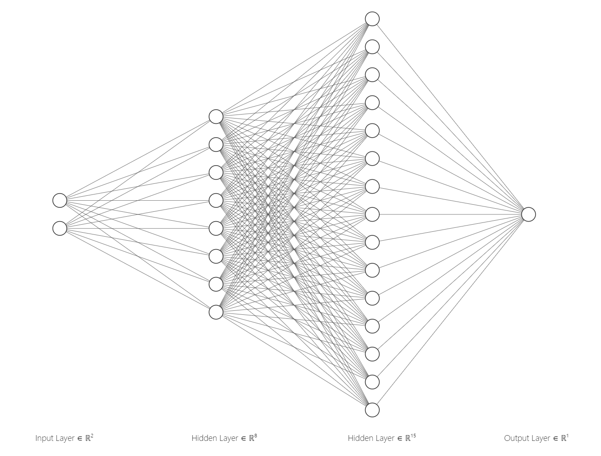

# <p align="center">Developing a Neural Network Regression Model</p>

## AIM

To develop a neural network regression model for the given dataset.

## THEORY

Neural networks consist of simple input/output units called neurons. These units are interconnected and each connection has a weight associated with it. Neural networks are flexible and can be used for both classification and regression. In this article, we will see how neural networks can be applied to regression problems.

Regression helps in establishing a relationship between a dependent variable and one or more independent variables. Regression models work well only when the regression equation is a good fit for the data. Although neural networks are complex and computationally expensive, they are flexible and can dynamically pick the best type of regression, and if that is not enough, hidden layers can be added to improve prediction.

Build your training and test set from the dataset, here we are making the neural network 3 hidden layer with activation layer as relu and with their nodes in them. Now we will fit our dataset and then predict the value.

## Neural Network Model
<p align="center">
    
</p>

## DESIGN STEPS

### STEP 1:

Loading the dataset

### STEP 2:

Split the dataset into training and testing

### STEP 3:

Create MinMaxScalar object, fit the model and transform the data.

### STEP 4:

Build the Neural Network Model and compile the model.

### STEP 5:

Train the model with the training data.

### STEP 6:

Plot the performance plot

### STEP 7:

Evaluate the model with the testing data.

## PROGRAM


```py

Developed by : ezhil mathi r 
Reg.no : 212221230026
Program to develop a neural network regression model..

### To Read CSV file from Google Drive :

from google.colab import auth
import gspread
from google.auth import default
import pandas as pd

### Authenticate User:

auth.authenticate_user()
creds, _ = default()
gc = gspread.authorize(creds)

### Open the Google Sheet and convert into DataFrame :

worksheet = gc.open('data').sheet1
rows = worksheet.get_all_values()
df = pd.DataFrame(rows[1:], columns = rows[0])
df = df.astype({'Input':'int','Output':'int'})

### Import the packages :

from sklearn.model_selection import train_test_split
from sklearn.preprocessing import MinMaxScaler
from tensorflow.keras.models import Sequential
from tensorflow.keras.layers import Dense

df.head()

X = df[['Input']].values
y = df[['Output']].values
X

### Split Training and testing set :

X_train,X_test,y_train,y_test = train_test_split(X,y,test_size = 0.33,random_state = 42)

### Pre-processing the data :

Scaler = MinMaxScaler()
Scaler.fit(X_train)
Scaler.fit(X_test)

X_train1 = Scaler.transform(X_train)
X_test1 = Scaler.transform(X_test)

X_train1

### Model :

ai_brain = Sequential([
    Dense(4,activation = 'relu'),
    Dense(6,activation = 'relu'),
    Dense(1)
])

ai_brain.compile(
    optimizer = 'rmsprop',
    loss = 'mse'
)

ai_brain.fit(X_train1,y_train,epochs = 4000)

### Loss plot :

loss_df = pd.DataFrame(ai_brain.history.history)

loss_df.plot()

### Testing with the test data and predicting the output :

ai_brain.evaluate(X_test1,y_test)

X_n1 = [[89]]

X_n1_1 = Scaler.transform(X_n1)

ai_brain.predict(X_n1_1)

```

## DATASET INFORMATION :


## OUTPUT:

### Initiation of program :


### Training Loss Vs Iteration Plot :


### Test Data Root Mean Squared Error :


### New Sample Data Prediction :


## RESULT :

Thus a neural network model for regression using the given dataset is written and executed successfully.
